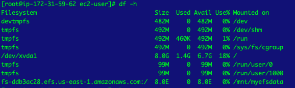
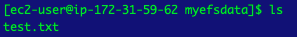
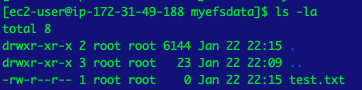

# aws-efs-ec2
Project to mount EFS on two EC2 instances

### Prerequisites

- [Sceptre](https://sceptre.cloudreach.com/2.4.0/) installed (For this quick tutorial). This tool is to deploy the CloudFormation stacks, however the CF stacks can also be deployed directly.

## Installation

1. Fill up with the right values for your use case in [dev.yaml](sceptre-project/vars/dev.yaml)

2. Locate in the right folder:
    ```
    cd sceptre-config
    ```
   
3. Deploy the whole environment, in this case dev. NOTE: you can add with as many environments as you wish.

    ``` 
    sceptre --var-file=vars/dev.yaml launch dev
    ```

## Testing

Sharing a file between the two EC2 instances.

1. At this point, you should have 2 EC2 instances deployed. Connect to the EC2 instance A with SSH:

    ```
    ssh -i <your-key> ec2-user@<ec2-instance-dns-name> 
    ```

2. To mount EFS:

    ```
    sudo su
    mkdir -p /your/mount/point/  
    chown ec2-user:ec2-user /your/mount/point/
    # In the command below change the FS id and the region
    mount -t nfs4 -o nfsvers=4.1,rsize=1048576,wsize=1048576,hard,timeo=600,retrans=2 fs-xxxxxxx.efs.us-east-1.amazonaws.com:/ /mnt/myefsdata 
    ```

3. You can verify your mount point is attached by using `df -h`:

    
    
4. Repeat the same steps with EC2 instance B

5. Now, we can create a file in EC2 instance A:

    ```  
    cd /your/mount/point
    sudo touch test.txt
    ls 
    ```

    
    
6. From EC2 instance B now you are able to see the shared file:

    ```  
    cd /your/mount/point       
    ls -la
    ```
       
    

           
